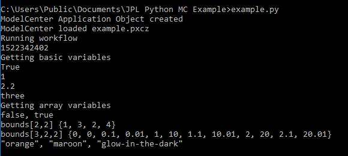
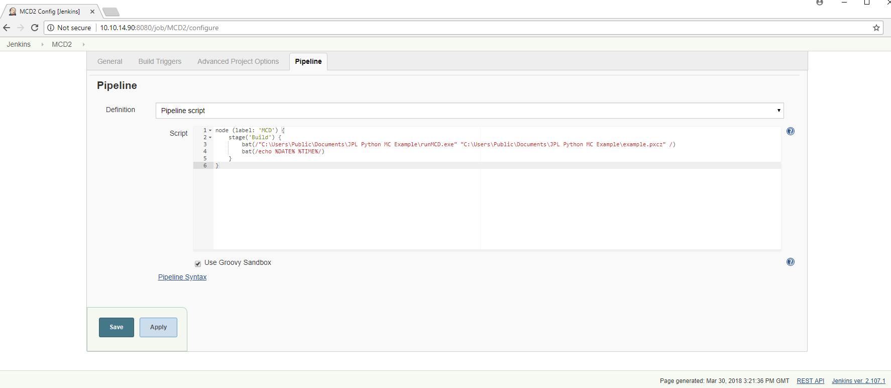
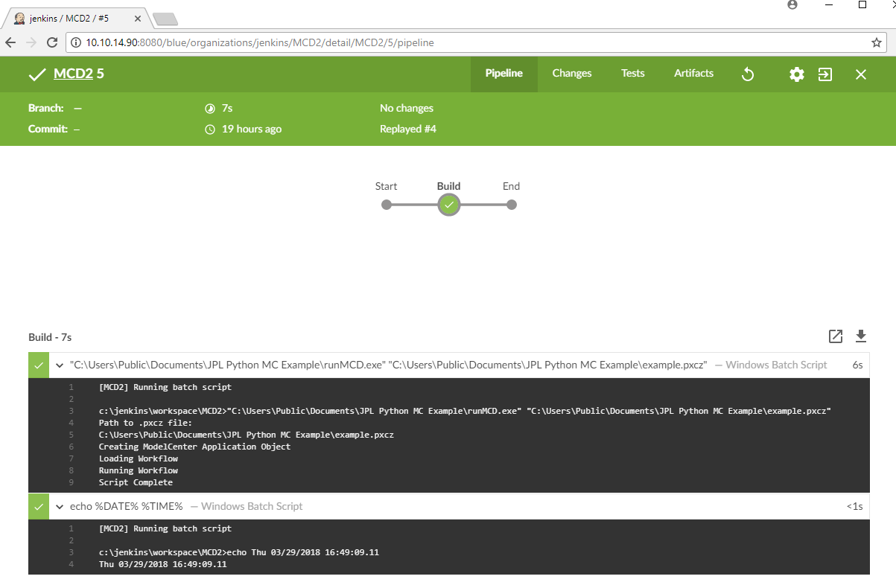

# JPL Jenkins & Python to ModelCenter Desktop Example

Examples of how to call a ModelCenter Desktop workflow (.pxcz) from a Python script and from a Jenkins build stage.

**Assumptions:**
* Default install of Python at `C:\Python27`
* Append the location of `python.exe` to the Path environment variable (e.g., `C:\Python27`)
* Python `comtypes` package installed (see below for instructions)
* Python `pyinstaller` package installed (see below for instructions)
* Read/Write/Execute access to Python install directory
* Default install of ModelCenter Desktop

Instructions for installing `comtypes` and/or `pyinstaller` using `pip`:
* On command line enter: `C:\Python27\Scripts\pip.exe install comtypes`
* On command line enter: `C:\Python27\Scripts\pip.exe install pyinstaller`

Also note that when the ModelCenter workflow `example.pxcz` runs it appends the date and time to a `log.txt` file in the path `C:\Users\Public\Documents\JPL Python MC Example\log.txt`, which is specified inside the workflow. The purpose of this log file is to verify that the workflow executed. 


## Python Calling ModelCenter Desktop

Instructions for Python wrapping ModelCenter Desktop to run a workflow:

* Open Command Prompt
* CD to directory with `example.py` and `example.pxcz` files.
* Run `example.py` on command line interface
* See below for example output:



* Review `example.py` for seeing how the Python code _gets_ and _sets_ variables in a ModelCenter Desktop workflow.

## Jenkins Calling ModelCenter Desktop

Instructions for setting up and running a ModelCenter workflow from Jenkins:

### Example Setup Information

* The Jenkins Master|head node was setup on a Linux|Debian node using https://bitnami.com/stack/jenkins/virtual-machine OVA VM.
* A Jenkins agent|slave was setup on a Windows machine with ModelCenter Desktop installed, with the Jenkins label `MCD` (this label is used in the Jenkins Pipeline script below).

### Creating `runMCD.exe`

* Open Command Prompt
* CD to directory with `runMCD.py` file.
* Run `pyinstaller -F runMCD.py`
* Find `runMCD.exe` in `dist` folder.


### Creating Jenkins Stage

* Put `runMCD.exe` and `example.pxcz` in a directory accessible by Jenkins (e.g., `C:\Users\Public\Documents\JPL Python MC Example\`) on the MCD Jenkins agent|slave
* Create a Jenkins pipeline job using `Pipeline script` (see image below)
* Include the following in the _script_ field:
```javascript
node (label: 'MCD') {
	stage('Build') {
		bat(/"C:\Users\Public\Documents\JPL Python MC Example\runMCD.exe" "C:\Users\Public\Documents\JPL Python MC Example\example.pxcz" /)
		bat(/echo %DATE% %TIME%/)
	}
}
```
* In the Pipeline script, ensure that the path for `runMCD.exe` and the `.pxcz` file are updated to reflect their location on the Jenkins agent

* See below for image of Pipeline definition:



### Jenkins Results

* After running the job the expected Blue Ocean result would look like the following:



<dl>
<!--So long and thanks for all the fish!-->
</dl>

